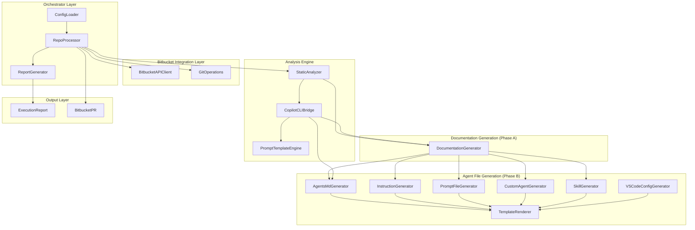
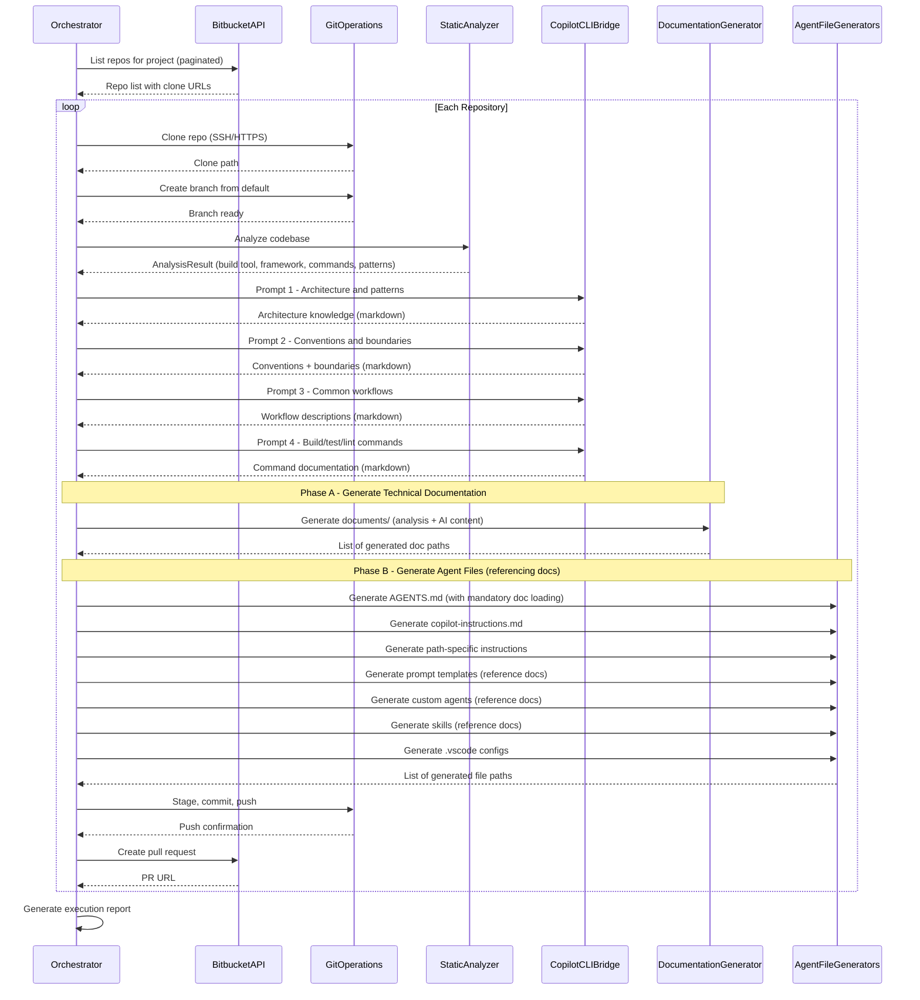
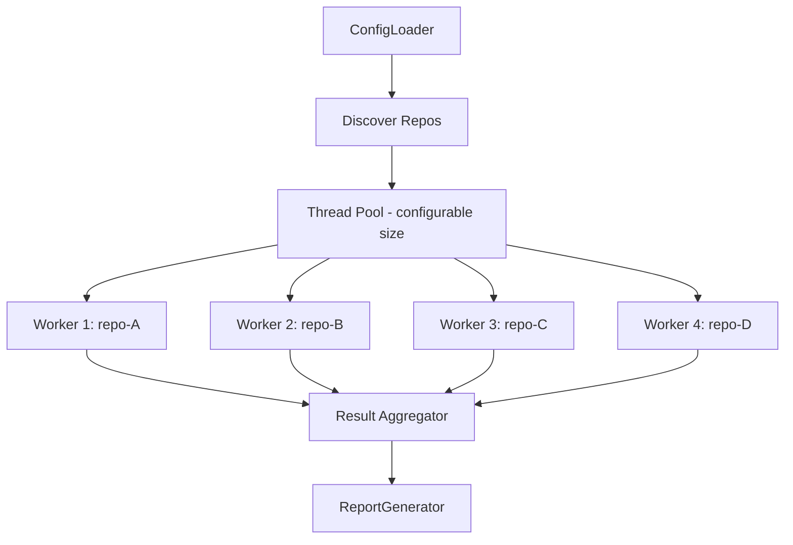
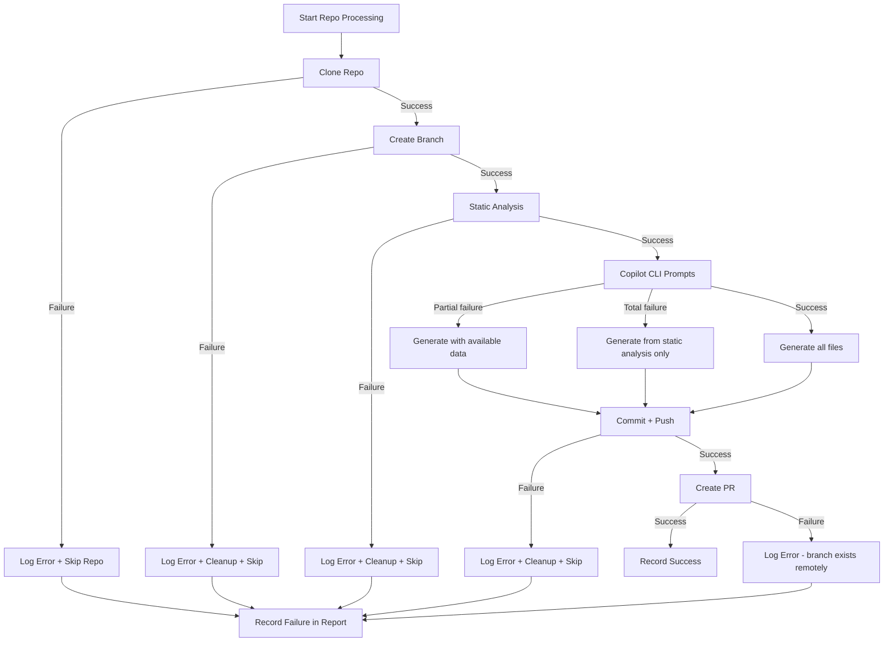

<!--
Copyright 2026 Copilot Context Enabler Contributors
SPDX-License-Identifier: Apache-2.0
-->

# High-Level Design: Copilot Context Enabler

**Version:** 1.0
**Status:** Draft
**Architecture:** Language-Agnostic (with Python vs Java comparison)

---

## 1. Architecture Overview

The Copilot Context Enabler is a modular application organized into five component groups. The architecture is identical regardless of implementation language; only the specific libraries differ.



---

## 2. Component Descriptions

### 2.1 Orchestrator Layer

#### ConfigLoader

Reads and validates the YAML configuration file. Resolves environment variable references for credentials. Produces a typed configuration object consumed by all other components.

**Responsibilities:**
- Parse YAML configuration
- Validate required fields (Bitbucket URL, at least one target project)
- Resolve `${env:VARIABLE_NAME}` placeholders from environment
- Provide default values for optional fields
- Fail fast with clear error messages on invalid configuration

#### RepoProcessor

The main orchestration loop. Iterates over target repositories, invoking the processing pipeline for each. Manages concurrency via a thread pool.

**Responsibilities:**
- Iterate over target projects and repositories from config
- For each repo: clone -> branch -> analyze -> generate -> commit -> push -> create PR
- Manage concurrent processing (configurable thread pool size)
- Isolate per-repo failures (catch, log, continue)
- Track per-repo status (success/failure/skipped) for the report

#### ReportGenerator

Produces the final execution report in both machine-readable (JSON) and human-readable (Markdown) formats.

**Responsibilities:**
- Aggregate per-repo results from RepoProcessor
- Compute summary statistics (total, succeeded, failed, skipped)
- Generate file inventory by category
- Write JSON and Markdown reports to the configured output directory

### 2.2 Bitbucket Integration Layer

#### BitbucketAPIClient

Wraps the Bitbucket Server 7.x REST API. Handles authentication, pagination, error handling, and rate limiting.

**API Operations:**

| Operation | Endpoint | Method |
|-----------|----------|--------|
| List repos in project | `/rest/api/latest/projects/{projectKey}/repos` | GET |
| Get repo details | `/rest/api/latest/projects/{projectKey}/repos/{repoSlug}` | GET |
| Get default branch | `/rest/api/latest/projects/{projectKey}/repos/{repoSlug}/default-branch` | GET |
| Create branch | `/rest/branch-utils/latest/projects/{projectKey}/repos/{repoSlug}/branches` | POST |
| Create pull request | `/rest/api/latest/projects/{projectKey}/repos/{repoSlug}/pull-requests` | POST |

**Pagination handling:**
```
Request:  ?start=0&limit=25
Response: { "values": [...], "start": 0, "limit": 25, "isLastPage": false, "nextPageStart": 25 }
```

The client iterates until `isLastPage` is `true`, collecting all values.

**Authentication:**
- HTTP Basic auth with username + personal access token
- Token sourced from environment variable (`BITBUCKET_TOKEN`)
- Username sourced from environment variable (`BITBUCKET_USER`)

#### GitOperations

Manages all git interactions with cloned repositories.

**Operations:**

| Operation | Detail |
|-----------|--------|
| Clone | Clone via SSH or HTTPS to configurable working directory; shallow clone (`--depth 1`) option for performance |
| Create branch | Create and checkout the feature branch from the configured base |
| Add files | Stage all generated files |
| Commit | Commit with a descriptive message |
| Push | Push the feature branch to origin |
| Cleanup | Delete the local clone directory after processing |

### 2.3 Analysis Engine

#### StaticAnalyzer

Performs deterministic analysis of the cloned repository by inspecting files and directory structure. No AI is used in this component.

**Analysis outputs:**

```
AnalysisResult {
    buildTool:        "maven" | "gradle" | "unknown"
    buildFile:        "pom.xml" | "build.gradle" | "build.gradle.kts"
    language:         "java"
    languageVersion:  "17" | "21" | ...
    framework:        "spring-boot" | "quarkus" | "micronaut" | "plain"
    frameworkVersion:  "3.2.x" | ...
    modules:          ["module-a", "module-b"] | []  (multi-module detection)
    sourceDir:        "src/main/java"
    testDir:          "src/test/java"
    resourceDir:      "src/main/resources"

    buildCommand:     "mvn clean verify" | "gradle build"
    testCommand:      "mvn test" | "gradle test"
    lintCommand:      "mvn spotless:apply" | null
    runCommand:       "mvn spring-boot:run" | null

    testingStack:     ["junit5", "mockito", "spring-boot-test", "testcontainers"]
    apiLayer:         "rest" | "graphql" | "grpc" | null
    databaseStack:    { orm: "jpa", migration: "flyway" | "liquibase" | null, pool: "hikari" }
    codeQualityTools: ["checkstyle", "spotbugs", "spotless"]

    directoryTree:    { ... structured representation of source tree ... }
    detectedPatterns: ["controller-service-repository", "dto-mapping", "exception-hierarchy"]
}
```

**Detection strategies:**

| What | How |
|------|-----|
| Maven | Presence of `pom.xml`; parse XML for plugins, dependencies, properties |
| Gradle | Presence of `build.gradle` or `build.gradle.kts`; parse for plugins and dependencies |
| Spring Boot | `spring-boot-starter-*` in dependencies |
| Test stack | `junit-jupiter`, `mockito-core`, `spring-boot-starter-test`, `testcontainers` in dependencies |
| Flyway | `flyway-core` in dependencies + `src/main/resources/db/migration/` directory |
| Multi-module | Child `<modules>` in parent pom.xml, or `include` in settings.gradle |

#### CopilotCLIBridge

Invokes GitHub Copilot CLI in programmatic mode to generate AI-assisted project knowledge.

**Invocation pattern:**
```
copilot -p "<prompt_text>"
```

Executed as a subprocess with the cloned repository as the working directory, so Copilot CLI has access to the full codebase.

**Multi-prompt strategy:**

| Prompt | Purpose | Input Data |
|--------|---------|-----------|
| Prompt 1: Architecture | Understand module structure, design patterns, layering | Directory tree, build file, framework detection |
| Prompt 2: Conventions | Extract naming patterns, error handling, logging, API format | Sample source files, static analysis results |
| Prompt 3: Boundaries | Identify what should never/always be done | Migration files, build config, framework patterns |
| Prompt 4: Workflows | Describe step-by-step procedures for common tasks | Detected patterns, API layer, test stack |
| Prompt 5: Commands | List and document build/test/lint/run commands | Build tool, plugin configuration |

Each prompt is constructed from a template (Jinja2/Freemarker) parameterized with the `AnalysisResult` from StaticAnalyzer.

**Output handling:**
- Capture stdout from the subprocess
- Parse the response as markdown
- Validate that expected sections are present
- Sanitize (remove any hallucinated file paths, code that doesn't exist)

#### PromptTemplateEngine

Manages the templates used to construct Copilot CLI prompts. Templates are parameterized with static analysis results.

**Template variables available:**

| Variable | Source |
|----------|--------|
| `buildTool` | StaticAnalyzer |
| `framework` | StaticAnalyzer |
| `testingStack` | StaticAnalyzer |
| `directoryTree` | StaticAnalyzer |
| `buildCommand`, `testCommand`, `lintCommand` | StaticAnalyzer |
| `modules` | StaticAnalyzer |
| `apiLayer` | StaticAnalyzer |
| `databaseStack` | StaticAnalyzer |

### 2.4 Documentation Generation Layer (Phase A)

Documentation is generated FIRST, before any agent context files. This creates the persistent knowledge base that all agent files will reference.

#### DocumentationGenerator

Generates detailed technical documents in the `documents/` directory of the target repository. Each document is produced from a combination of static analysis results and AI-generated content.

**Generated documents:**

| Document | Primary Source | Content |
|----------|---------------|---------|
| `documents/architecture.md` | Copilot CLI (Prompt 1) + StaticAnalyzer | Module structure, design patterns, layering, dependencies |
| `documents/coding-conventions.md` | Copilot CLI (Prompt 2) + StaticAnalyzer | Naming, style, error handling, logging, idioms |
| `documents/api-design.md` | Copilot CLI (Prompt 2) + StaticAnalyzer | REST/GraphQL patterns, URL structure, auth, error format |
| `documents/testing-strategy.md` | Copilot CLI (Prompt 2) + StaticAnalyzer | Frameworks, patterns, fixtures, mocking approach |
| `documents/data-layer.md` | Copilot CLI (Prompt 1+3) + StaticAnalyzer | Schema patterns, ORM, migrations, transactions |
| `documents/build-and-commands.md` | StaticAnalyzer (primary) + Copilot CLI (Prompt 4) | Build/test/lint/run commands, CI/CD, dependency management |
| `documents/common-workflows.md` | Copilot CLI (Prompt 3) | Step-by-step procedures for frequent development tasks |

Conditional generation: documents are only created when relevant patterns are detected (e.g., `data-layer.md` is skipped if no database dependencies are found, `api-design.md` is skipped if no REST/GraphQL layer is detected).

Each document contains:
- Specific code examples extracted from the actual codebase
- References to actual file paths in the repository
- Enough detail to onboard a new developer

**Output:** A list of `GeneratedFile` entries representing the created documents. This list is passed to Phase B generators so they can reference the document paths.

### 2.5 Agent File Generation Layer (Phase B)

Agent files are generated AFTER documentation. All agent files reference the generated `documents/` directory, ensuring the agent loads deep project knowledge before acting.

All generators follow the same pattern:
1. Accept `AnalysisResult` (from StaticAnalyzer), AI-generated content (from CopilotCLIBridge), and the list of generated document paths (from DocumentationGenerator)
2. Merge static + AI content using an output template
3. Write the generated file to the cloned repository
4. Return the file path and metadata for the report

#### AgentsMdGenerator

Generates the root `AGENTS.md` file. The critical difference from a naive implementation is the **mandatory context loading section** that references the generated documentation.

**Template structure:**
```markdown
# Agent Instructions

## Mandatory Context Loading

Before performing any task on this project, you MUST read and internalize
the project documentation stored in the `documents/` directory. These files
are the single source of truth for this project's architecture, patterns,
and conventions.

**Always read these files first:**

{for each generated_doc in documents}
- `{generated_doc.path}` -- {generated_doc.description}
{end for}

You must align every code change with what these documents specify.
If a task contradicts the documented patterns, flag the conflict
before proceeding.

## Persona
{ai_generated_persona}

## Tech Stack
- Language: {language} {languageVersion}
- Framework: {framework} {frameworkVersion}
- Build Tool: {buildTool}
- Database: {databaseStack}

## Project Structure
{directory_tree_formatted}

## Commands
- Build: `{buildCommand}`
- Test: `{testCommand}`
- Lint: `{lintCommand}`
- Run: `{runCommand}`

## Boundaries
{ai_generated_boundaries}

### Never
- Never make changes that contradict the patterns documented in `documents/`
{ai_generated_never_rules}

### Always
- Always read `documents/` before starting any task
{ai_generated_always_rules}

## Conventions
{ai_generated_conventions_summary}
```

#### InstructionGenerator

Generates `.github/copilot-instructions.md` and path-specific `.github/instructions/*.instructions.md` files.

**Path-specific file generation logic:**
1. Check which patterns exist in the codebase (controllers, services, repositories, tests, migrations)
2. For each detected pattern, generate a corresponding `.instructions.md` with the appropriate `applyTo` glob
3. Content for each instruction file is sourced from Copilot CLI analysis of files matching that pattern

#### PromptFileGenerator

Generates `.github/prompts/*.prompt.md` files for detected workflows.

**Workflow detection:**
- If REST controllers detected -> generate `add-rest-endpoint.prompt.md`
- If test directory with integration tests detected -> generate `write-integration-tests.prompt.md`
- If service layer detected -> generate `add-service-class.prompt.md`
- If migration tool detected -> generate `database-migration.prompt.md`
- If DTO/mapper pattern detected -> generate `add-dto-mapping.prompt.md`

Each prompt file includes YAML frontmatter (`agent: agent`, `tools: [...]`) and a structured task description with `${input:*}` variables. Prompt templates reference the generated `documents/` for context (e.g., `add-rest-endpoint.prompt.md` references `documents/api-design.md` and `documents/common-workflows.md`).

#### CustomAgentGenerator

Generates `.github/agents/*.agent.md` files for specialized roles.

**Generation logic:**
- Always generate a `test-specialist.agent.md` (all repos have tests or should)
- If API layer detected -> generate `api-reviewer.agent.md`
- If migration tool detected -> generate `migration-helper.agent.md`

Each agent file includes YAML frontmatter (`name`, `description`, `tools`) and a detailed persona with instructions and boundaries. Each custom agent's instructions include a directive to read the relevant documents from `documents/` (e.g., `test-specialist` references `documents/testing-strategy.md`, `migration-helper` references `documents/data-layer.md`).

#### SkillGenerator

Generates `.github/skills/**/SKILL.md` files for multi-step workflows.

**Generation logic:**
- If migration tool + JPA detected -> generate `database-migration/SKILL.md`
- If REST + full stack detected -> generate `new-endpoint/SKILL.md`
- If tests + CI detected -> generate `test-and-verify/SKILL.md`

Each skill includes YAML frontmatter (`name`, `description`) and numbered steps with verification commands.

#### VSCodeConfigGenerator

Generates `.vscode/settings.json` and `.vscode/extensions.json`.

**Merge strategy for settings.json:**
1. If file exists, parse existing JSON
2. Deep-merge new settings (agent-related keys) into existing
3. Never overwrite non-Copilot settings
4. Write formatted JSON

**Merge strategy for extensions.json:**
1. If file exists, parse existing recommendations array
2. Add new recommendations without duplicating
3. Write formatted JSON

#### TemplateRenderer

The shared rendering engine used by all generators. Accepts a template name and a data dictionary, produces the final file content.

### 2.5 Output Layer

#### Execution Report

A JSON file and a Markdown summary written to the output directory.

**JSON schema:**
```json
{
  "runTimestamp": "2026-03-09T14:30:00Z",
  "configuration": { "bitbucketUrl": "...", "targetProjects": [...] },
  "summary": {
    "totalTargeted": 18,
    "processed": 17,
    "succeeded": 15,
    "failed": 2,
    "skipped": 1
  },
  "fileInventory": {
    "agentsMd": 15,
    "copilotInstructions": 15,
    "pathInstructions": 52,
    "promptTemplates": 41,
    "customAgents": 38,
    "skills": 27,
    "vscodeConfigs": 30
  },
  "repositories": [
    {
      "project": "PROJ1",
      "repo": "order-service",
      "status": "succeeded",
      "branch": "copilot-context/enhance",
      "prUrl": "https://bitbucket.company.com/projects/PROJ1/repos/order-service/pull-requests/42",
      "filesGenerated": {
        "AGENTS.md": true,
        ".github/copilot-instructions.md": true,
        ".github/instructions/test-conventions.instructions.md": true,
        ".github/prompts/add-rest-endpoint.prompt.md": true,
        ".github/agents/test-specialist.agent.md": true,
        ".github/skills/database-migration/SKILL.md": true,
        ".vscode/settings.json": true,
        ".vscode/extensions.json": true
      },
      "errors": []
    }
  ]
}
```

#### Bitbucket PR

The pull request created for each repository, containing:
- Title: configurable template (e.g., `[Copilot Agent] Add AI agent context files for order-service`)
- Description: auto-generated markdown listing all created files organized by category
- Source branch: `copilot-context/enhance`
- Target branch: repository default branch
- Reviewers: from configuration

---

## 3. Data Flow

### Per-Repository Processing Pipeline



### Concurrency Model



Each worker processes one repository independently. Workers share no state. The thread pool size is configurable (default: 4) and should be tuned based on available CPU, memory, and Copilot CLI rate limits.

---

## 4. Configuration Schema

```yaml
# ------------------------------------------------------------------
# Copilot Context Enabler Configuration
# ------------------------------------------------------------------

bitbucket:
  base_url: "https://bitbucket.company.com"
  auth_type: "token"                          # "token" or "basic"
  # Credentials sourced from environment variables:
  #   BITBUCKET_USER  - username
  #   BITBUCKET_TOKEN - personal access token (for auth_type: token)
  #   BITBUCKET_PASS  - password (for auth_type: basic)

targets:
  - project_key: "INSURANCE"
    repos: []                                  # empty = all repos in project
  - project_key: "PAYMENTS"
    repos: ["payment-gateway", "invoice-svc"]  # specific repos only

branch:
  name: "copilot-context/enhance"
  base: "main"                                 # default branch to branch from

processing:
  concurrency: 4                               # parallel repo processing threads
  clone_dir: "/tmp/copilot-enabler"            # working directory for clones
  clone_depth: 1                               # shallow clone depth (0 = full)
  cleanup_after: true                          # delete clones after processing

copilot_cli:
  binary: "copilot"                            # path to Copilot CLI binary
  timeout_seconds: 120                         # per-prompt timeout
  retry_count: 2                               # retries on transient failure
  retry_delay_seconds: 10                      # delay between retries

generation:
  agents_md: true
  copilot_instructions: true
  path_instructions: true
  prompt_templates: true
  custom_agents: true
  skills: true
  vscode_config: true

pr:
  title_template: "[Copilot Agent] Add AI agent context files for {repo_name}"
  description_template: "auto"                 # "auto" generates from file list
  reviewers: ["senior-dev-1", "tech-lead"]
  draft: false                                 # create as draft PR

report:
  output_dir: "./reports"
  formats: ["json", "markdown"]
```

---

## 5. Generated File Structure Per Repository

After the tool runs, a target repository will contain the following new files:

```
<repository-root>/
├── AGENTS.md                                       (references documents/)
├── documents/                                      (Phase A -- generated first)
│   ├── architecture.md
│   ├── coding-conventions.md
│   ├── api-design.md                               (if REST/GraphQL detected)
│   ├── testing-strategy.md
│   ├── data-layer.md                               (if database detected)
│   ├── build-and-commands.md
│   └── common-workflows.md
├── .github/
│   ├── instructions/
│   │   ├── test-conventions.instructions.md
│   │   ├── controller-patterns.instructions.md
│   │   ├── service-patterns.instructions.md
│   │   ├── repository-patterns.instructions.md
│   │   └── migration-rules.instructions.md        (if migrations detected)
│   ├── prompts/
│   │   ├── add-rest-endpoint.prompt.md             (if REST detected)
│   │   ├── write-integration-tests.prompt.md
│   │   ├── add-service-class.prompt.md
│   │   ├── database-migration.prompt.md            (if migrations detected)
│   │   └── add-dto-mapping.prompt.md               (if DTO pattern detected)
│   ├── agents/
│   │   ├── test-specialist.agent.md
│   │   ├── api-reviewer.agent.md                   (if REST detected)
│   │   └── migration-helper.agent.md               (if migrations detected)
│   └── skills/
│       ├── database-migration/
│       │   └── SKILL.md                            (if migrations detected)
│       └── new-endpoint/
│           └── SKILL.md                            (if REST detected)
└── .vscode/
    ├── settings.json
    └── extensions.json
```

Not all files are generated for every repository. Generation is conditional on detected patterns (e.g., migration-related files are only created if Flyway or Liquibase is detected).

---

## 6. Technology Comparison: Python vs Java

### Library Mapping

| Component | Python | Java |
|-----------|--------|------|
| HTTP client | `requests` 2.31+ | `java.net.http.HttpClient` (built-in) or OkHttp 4.x |
| Git operations | GitPython 3.1+ | JGit 6.x (Eclipse) |
| YAML parsing | PyYAML 6.0+ | SnakeYAML 2.x or Jackson YAML |
| Template engine | Jinja2 3.1+ | Freemarker 2.3.x |
| JSON handling | `json` (built-in) | Jackson 2.x |
| Subprocess | `subprocess` (built-in) | `ProcessBuilder` (built-in) |
| Concurrency | `concurrent.futures.ThreadPoolExecutor` | `ExecutorService` / Virtual Threads (Java 21) |
| Logging | `logging` + `rich` for console output | SLF4J 2.x + Logback 1.4.x |
| CLI framework | `click` or `argparse` | Picocli 4.x |
| XML parsing (pom.xml) | `xml.etree.ElementTree` (built-in) | `maven-model` 3.x (native Maven POM parsing) |
| Testing | pytest 8.x | JUnit 5 + Mockito 5.x |
| Build/packaging | `pyproject.toml` (PEP 621) | Maven (`pom.xml`) |

### Trade-off Summary

| Dimension | Python | Java |
|-----------|--------|------|
| Development speed | Faster (less boilerplate) | Slower (~2 weeks longer) |
| Type safety | Dynamic typing, optional type hints | Strong static typing |
| Team familiarity | May require Python knowledge | Matches existing team skills |
| POM parsing | Basic XML parsing | Rich native parsing via `maven-model` |
| Concurrency | Good (ThreadPoolExecutor) | Excellent (Virtual Threads on Java 21) |
| Deployment | Python 3.10+ runtime required | JAR with embedded runtime possible |
| Long-term maintenance | Higher risk if team is Java-only | Natural fit for Java team |
| Estimated timeline | ~6-7 weeks | ~7-9 weeks |

### Recommendation

- **Pilot phase (< 20 repos):** Python is faster to develop and iterate on. Prompt engineering (the highest-risk activity) can be refined more quickly.
- **Production at scale (100+ repos):** Java is the stronger choice if the team will own and maintain the tool long-term, given the team's Java expertise and the benefits of type safety.
- **Pragmatic approach:** Build the pilot in Python to validate the concept, then rewrite in Java if it graduates to production. Or go straight to Java if minimizing throwaway work is the priority.

---

## 7. Error Handling Strategy

### Per-Repository Isolation

Each repository is processed independently. A failure in one repository does not affect others.



### Copilot CLI Failure Handling

Since Copilot CLI prompts are independent, failure of one prompt does not block others:

| Scenario | Behavior |
|----------|----------|
| Prompt 1 (architecture) fails | Skip architecture content; generate AGENTS.md with static data only |
| Prompt 2 (conventions) fails | Skip convention content; copilot-instructions.md will be thinner |
| Prompt 3 (workflows) fails | Skip prompt templates and skills; generate other files |
| All prompts fail | Generate all files using static analysis data only (degraded but functional) |
| Copilot CLI not found | Fail fast with clear error message; do not process any repos |

### Retry Logic

- Transient failures (network timeout, HTTP 429/503) are retried with exponential backoff
- Configurable retry count (default: 2) and base delay (default: 10 seconds)
- Non-transient failures (HTTP 401/403/404, parse errors) are not retried

---

## 8. Security Considerations

| Area | Approach |
|------|----------|
| Credentials | Never in config files; sourced from `BITBUCKET_USER`, `BITBUCKET_TOKEN` environment variables |
| Secrets manager | Optional integration point; config can reference a secrets manager path instead of env vars |
| Clone directories | Created in temp directory; cleaned up after processing (configurable) |
| Generated content | Copilot CLI output is sanitized; no secrets or sensitive values should appear in generated markdown |
| Network | HTTPS for all Bitbucket API calls; SSH or HTTPS for git clone (configurable) |
| Permissions | The Bitbucket user needs: repo read, branch create, PR create -- no admin access required |
| Audit | All operations logged with timestamps for audit trail |

---

## 9. Scalability Path

### Pilot (< 20 Repositories)

- Single machine execution
- Thread pool with 4 workers
- Sequential Copilot CLI calls per repo (4-5 prompts x ~30 seconds each = ~2-3 minutes per repo)
- Total estimated time: 40-60 minutes for 20 repos

### Medium Scale (20-100 Repositories)

- Same architecture, increase thread pool to 8-12 workers
- Consider running on a CI/CD agent with more CPU/memory
- Estimated time: 1-3 hours

### Large Scale (100-500+ Repositories)

- Introduce a job queue (Celery/RQ for Python; Spring Batch or custom queue for Java)
- Distribute across multiple worker machines
- Add a persistent state store (database or file) to track which repos have been processed and their last-run timestamp
- Support incremental runs: only re-process repos that have changed since the last run
- Consider Copilot CLI rate limits as the primary bottleneck at this scale
